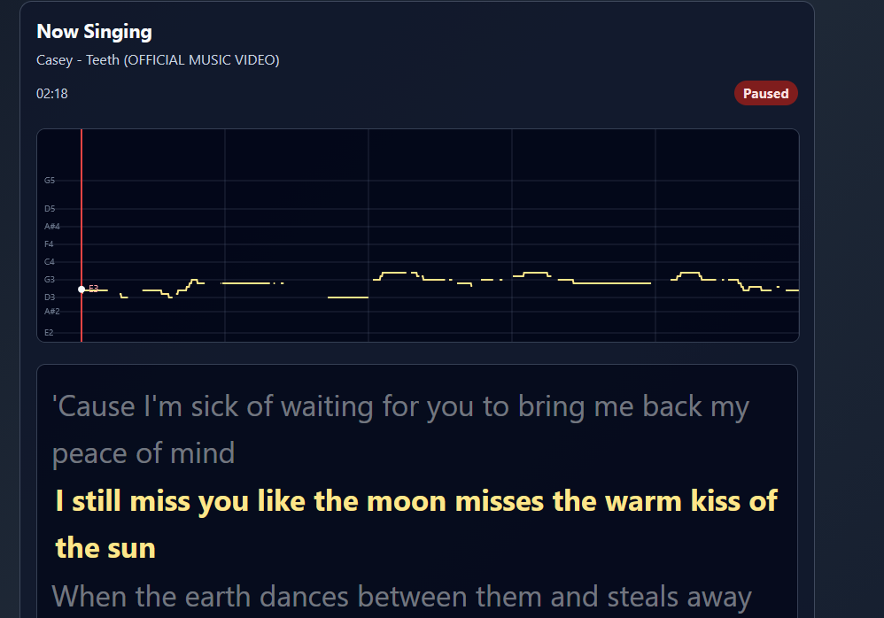

# 🎤 Calvin's Karaoke

Welcome to **Calvin's Karaoke**! This is a web app I built that lets you sing your favorite songs, even if an official karaoke track doesn't exist. 

Just find a song on YouTube, add it to your queue, and let the app do the rest. It uses AI to magically strip away the vocals, grabs the synchronized lyrics, and gives you a real-time pitch monitor so you can see if you're actually hitting the notes!

---

## ✨ What makes it cool?



* **Just Paste a Link:** Pop in a YouTube URL and the app downloads the audio automatically.
* **Mix Your Own Tracks:** Because we use AI (Demucs) to separate the vocals and the instruments into different tracks, you can mix exactly how much of each you want! Sometimes when you're singing karaoke, you might just want less of the original vocals without removing them completely to help you stay on track—now you can dial in the perfect mix.
* **Live Pitch Feedback:** It extracts the exact pitch of the original singer and puts it on screen. As you sing into your mic, you'll see your own pitch line right next to it so you can see how well you're doing. 
* **Auto-Synced Lyrics:** It scours the web for the `.lrc` file of your song so the words light up perfectly in time with the music.
* **Dual-Screen Friendly:** You can pop out the actual karaoke player into its own window. This is perfect for putting the lyrics on a TV while you manage the queue on your laptop.
* **No Waiting Around:** You can play songs from your library while your new YouTube links are downloading and processing in the background.

---

## 🚀 How to set it up

**What you need:** Python 3.10 or newer. *(Highly recommended: A decent GPU. The AI vocal removal takes a long time if you're only using a CPU!)*

**1. Download the app**
```bash
git clone https://github.com/calvinbootsman/CalvinsKaraoke.git
cd CalvinsKaraoke
```

**2. Install the requirements**
*(Note: If you have an NVIDIA GPU, make sure you install PyTorch with CUDA support first!)*
```bash
pip install -r requirements.txt
```

**3. Start it up!**
Because of how browsers handle audio files, we need to run two quick commands in two separate terminal windows.

*Terminal 1 (This handles serving the music files):*
```bash
python music/cors_server.py
```

*Terminal 2 (This runs the actual app):*
```bash
streamlit run app.py
```

---

## 🎮 How to use it

1. **Add Songs:** Go to the "Process New Song" tab, paste a YouTube link, and hit Process. 
2. **Manage your Library:** Check out the "Saved" tab to see everything you've downloaded. If a song is missing lyrics or pitch data, just hit "Reprocess" to fix it.
3. **Queue it up:** Drag and drop songs into your Queue.
4. **Sing!:** As soon as you interact with the player, the Karaoke Window will pop out. Grab a mic (make sure your browser has microphone permissions allowed), and start singing!

---

## 🛠️ Nerd Stuff (How it works under the hood)

If you're curious about the tech stack:
* **The UI:** Built with Streamlit for the main controls, and vanilla HTML/JS for the pop-out player. 
* **The Brains:** Uses `yt-dlp` to download, `demucs` to remove vocals, `torchcrepe` to map the pitch, and `syncedlyrics` to find the words.
* **The Bridge:** The main Streamlit app and the pop-out window talk to each other instantly using your browser's HTML5 `BroadcastChannel` and `LocalStorage`. No lag!

---
*Made with ❤️ for karaoke nights.*